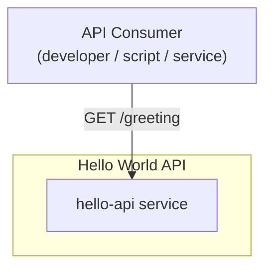
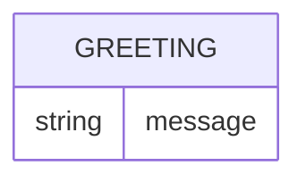
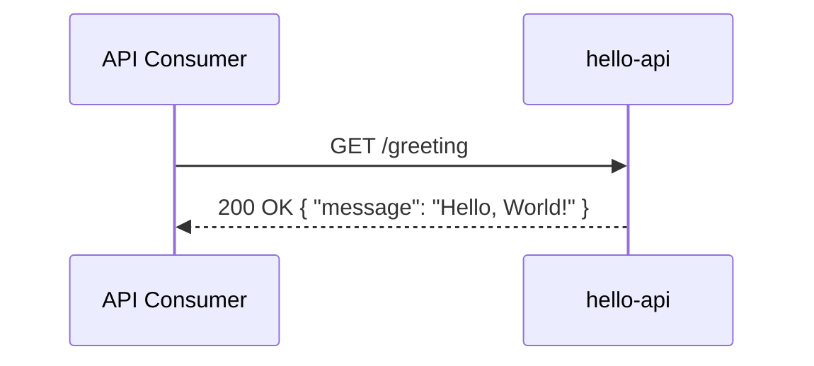

# Hello World API — Design

## Overview

A single public Ballerina service, `hello-api`, exposes one HTTP endpoint that
returns a static "Hello, World!" greeting. There is no persistence, no
authentication, and no other component — the whole product is this one
service, reachable directly from the internet through the platform gateway.

## Context (C1)

## Domain model (ER)

No persisted entities — the service is stateless and holds no data model. The
response is a transient value object only:

## Key flows

